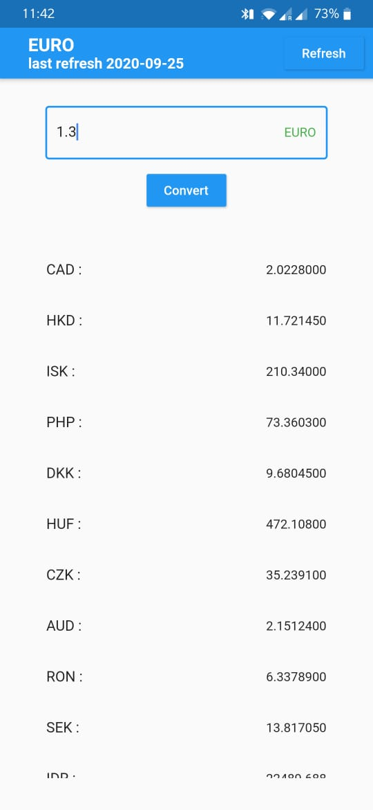

# currency_converter

Currency Converter

##Ios and Android Flutter Project

The objective of this app is to convert currency,base as Euro.

Technologies Used:
1.Dart
2.Flutter
3.Git and Github
4.Rest API

Packages Used:
1.https://api.exchangeratesapi.io/latest

Following Screenshots of the app:

